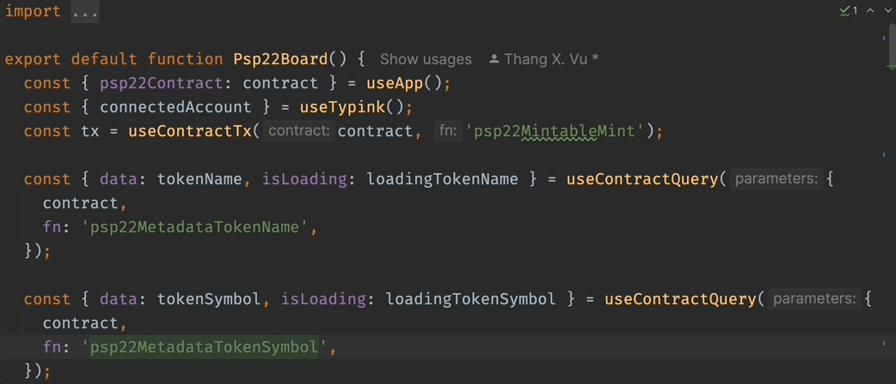

# Introducing Typink

## Overview

The **ink! smart contract language** is an essential component of the **Polkadot ecosystem**, enabling developers to build decentralized applications (dApps) using **Rust-based smart contracts**. As the ecosystem evolves, **ink!** is now maintained by a dedicated community and continues to see promising advancements.

However, while **ink!** is powerful, integrating with its smart contracts remains a challenge for developers. Many struggle with the **lack of a fully type-safe API for contract interactions**, making development **prone to errors** and **less efficient**. Furthermore, **contract event handling** is often cumbersome, and existing tooling does not provide optimal solutions for **wallet authentication** and **multi-chain compatibility**.

To address these challenges, we introduce **Typink**.

## Limitations of current toolings

While the ink! ecosystem has evolved significantly, developing decentralized applications (dApps) with ink! smart contracts still presents several challenges.&#x20;

Existing tooling has made great strides in simplifying contract interactions, but there are areas where improvements can further enhance the developer experience:

1. **Lack of TypeSafe API for contract interactions** – Many utilities support contract interactions, but strict type enforcement at the message and event level is missing, leading to runtime errors and complex debugging.
2. **Inflexible Wallet Connectors Integration** – Current solutions tightly couple wallet authentication with client connections, limiting flexibility for multiple authentication methods or custom wallets.
3. **Inefficient Event Handling** – Existing implementations lack a structured, type-safe approach to contract event subscriptions, causing inconsistent handling and added development effort.
4. **Code Generation Overhead** – While useful for type safety, code generation increases bundle size and complexity, which may be excessive for lightweight applications.

Addressing these challenges requires a modernized approach—one that **prioritizes type safety, flexibility, and lightweight integration** while ensuring that contract interactions are efficient, scalable, and easy to maintain. This is where **Typink** comes in.

## **Introducing Typink!**

**Typink** is a **fully type-safe React hooks library** designed to **accelerate ink! dApp development** and **seamlessly integrate smart contracts**. Built on top of **Dedot’s powerful type system**, Typink ensures **reliable, efficient, and scalable contract interactions**.

Let's discover the Key Features That Make Typink Stand Out

### **Fully Type-Safe React Hooks**

Typink offers fully type-safe React hooks for both contract messages and event handling. This ensures complete confidence when submitting messages and parameters to contracts, as well as when processing events emitted from them. No more guesswork—just robust, predictable interactions.

<figure><figcaption></figcaption></figure>

### **Built-in CLI to start new project**

Kickstarting a new project has never been this effortless. With our built-in CLI, `create-typink`, you can launch a new project in under 30 seconds. Simply run the command, and you'll be ready to bring your ideas to life in no time.

<figure><figcaption></figcaption></figure>

### **Decoupled Wallet Connector Integration**

Say goodbye to rigid wallet connector limitations. Typink supports a range of external wallet connectors like [SubConnect](https://github.com/Koniverse/SubConnect-v2) and [Talisman Connect](https://github.com/TalismanSociety/talisman-connect), giving you the freedom to choose your preferred solution. Want to build your own wallet connector? We provide the utilities to make that easy, too.&#x20;

Just select your desired wallet connector during project setup, and you're ready to go.

<figure><figcaption></figcaption></figure>

### **Multi-chain supports with lazy initialization**

Developing multi-chain dApps has never been smoother. Typink supports contracts deployed across multiple networks, allowing seamless network switching with just a single click. Your dApp adapts effortlessly to wherever your contracts live, providing a streamlined user experience.

<figure><figcaption></figcaption></figure>

Switching networks

<figure><figcaption></figcaption></figure>

## Getting started now!

We've put together a quick tutorial that guide you through the process of building a simple ink! dApp using Typink, dive in right now to see the differences!

* Tutorial: [Develop ink! dApp using Typink](https://docs.dedot.dev/help-and-faq/tutorials/develop-ink-dapp-using-typink)
* Github Repo: [psp22-transfer](https://github.com/sinzii/psp22-transfer)

## Conclusion

Typink is a game-changer for ink! developers, providing a fully type-safe, efficient, and developer-friendly solution for integrating smart contracts into your ink! dApps. Unlike existing tools, it prioritizes type safety, flexibility, and performance, enabling faster development and fewer errors.

With Typink, developing ink! dApps has never been easier. [Get started today](https://github.com/dedotdev/typink?tab=readme-ov-file#start-a-new-project-from-scratch) and build the next-generation Polkadot applications with confidence!

**Build with confidence. Build with Typink.**
