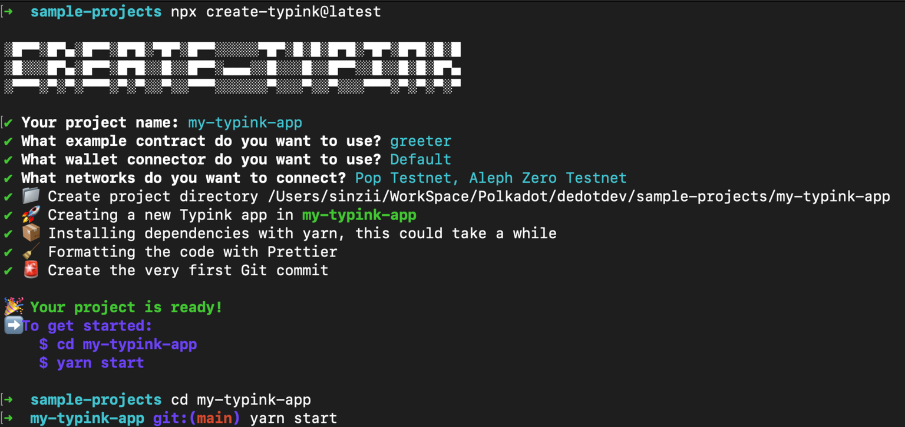

# Start a new dapp

## **Setup your new project via `create-typink` cli**

Typink comes with a cli to help you start a new project from scratch faster & easier, to create a new project, simply run the below command using your prefered package manager:



pnpm create typink@latest



yarn create typink@latest



npm create typink@latest



bun create typink@latest








The `create-typink` cli requires NodeJS version >= `v20` to work properly, make sure to check your NodeJS version.


Follows the instructions, the cli will help you generate a starter & working project ready for you to start integrate your own contracts and build your own logic:

<figure><figcaption></figcaption></figure>

After initialize the project, you can now spin up the development server with the following command:

```shell
cd my-ink-dapp # project folder

yarn start
```


Please note that `yarn` is the current default package manager for the start project, make sure to [install `yarn`](https://yarnpkg.com/getting-started/install) on your machine to streamline the development process.


## Project structure

The generated project consists of 2 main packages:

* `contracts`: ink! contract artifacts & generated types
  * `contracts/artifacts`: ink! contract artifacts (.wasm, .json or .contract file), this is where you put your contract artifacts here.
  * `contracts/types`: Typescript bindings for each ink! contract, these can be generated through [`dedot` cli](https://github.com/dedotdev/typink#2-generate-typescript-bindings-types-for-your-ink-contracts-from-the-metadata)
* `ui`: Main UI project, a React-based client.

<figure><figcaption></figcaption></figure>

## Setup & register contract deployments

Before interacting with your contracts, we need a few more steps to setup & register your contract deployments to Typink.

### Put your contracts artifacts to `contracts/artifacts` folder

Contract artifacts consists of a contract metadata file (.json), a contract wasm file (.wasm) and a .contract file (metadata + wasm). After you compiled your contracts, a good practice is to copy the artifacts to `contracts/artifacts`folder of the project. You'll only need the metadata file to interact with your deployed contracts, but we recommend keeping other files (.wasm, .contract) in the same place for tracking purposes.

<figure><figcaption></figcaption></figure>

### Deploy your contracts to a ink! contract supported network

You have several options to deploy your ink! contracts to, please checkout the list [here](https://use.ink/where-to-deploy) to find the network that you refer to deploy your contracts.

Follow the [instructions](https://use.ink/getting-started/deploy-your-contract) here to deploy your contract via [Contracts UI](https://ui.use.ink/). You can also deploy the contracts via [`cargo contract`cli](https://use.ink/getting-started/deploy-your-contract/#using-cargo-contract), but we recommend using an UI like [Contracts UI](https://ui.use.ink/) as a friendly & intuiative approach.

You will get a Subtrated-based address for the contracts once you successfully deployed them to the networks.

### Generate Typescript bindings for your contracts from metadata files

Now we need to generate Typescript bindings for your contracts from the metadata files, Typink later can leverage these Typescript bindings to enable auto-suggestions/IntelliSense when you interact with your contracts. This is an important step that help you confidently interact with your contracts.

You can generate the Typescript binding using [`dedot`cli](https://docs.dedot.dev/cli#dedot-typink), we will put these types in `contracts/types` folder. Let's generate types for `greeter` & `psp22` contracts

```sh
npx dedot typink -m ./greeter.json -o ./contracts/types

npx dedot typink -m ./psp22.json -o ./contracts/types
```

After running the commands, the types will generated into the `contracts/types` folder. You'll get the top-level type interface for `greeter` & `psp22` contracts as: `GreeterContractApi` and `Psp22ContractApi`.


It's a good practice to put these commands to a shortcut script in th `package.json` file so you can easily regenerate these types again whenver you update the metadata for your contracts

```json
{
   // ...
   "scripts": {
      "typink": "npx dedot typink -m ./greeter.json -o ./contracts/types && npx dedot typink -m ./psp22.json -o ./contracts/types"
   }
   // ...
}
```


To regenerate the types again, simply run:

```sh
npm run typink

# or
yarn typink

# or
pnpm typink
```


### Register your contract deployments

Typink needs to know your contract deployments information (address, metadata, ...) to help you do the magic under the hood. The `ContractDeployment` interface have the following structure:

```tsx
interface ContractDeployment {
  id: string; // A unique easy-to-remember contract id, recommened put them in an enum
  metadata: ContractMetadata | string; // Metadata for the contract
  address: SubstrateAddress; // Address of the contract
  network: string; // The network id that the contract is deployed to, e.g: Pop Testnet (pop_testnet), Aleph Zero Testnet (alephzero_testnet) ...
}
```

We'll put your contract deployments information in file:  `contract/deployments.ts` so you can easily manage them. Each of your contract will be given an unique id (`string`), so it will be easier later when you want refer to which contract you want to interact with.


```typescript
import { ContractDeployment, popTestnet } from 'typink';
import greeterMetadata from './artifacts/greeter/greeter.json';
import psp22Metadata from './artifacts/psp22/psp22.json';

export enum ContractId {
  GREETER = 'greeter',
  PSP22 = 'psp22',
}

export const deployments: ContractDeployment[] = [
  {
    id: ContractId.GREETER,
    metadata: greeterMetadata as any,
    address: '5HJ2XLhBuoLkoJT5G2MfMWVpsybUtcqRGWe29Fo26JVvDCZG',
    network: popTestnet.id
  },
  {
    id: ContractId.PSP22,
    metadata: psp22Metadata as any,
    address: '16119BccKAfWwbt4TCNvfLBDuRWHSeFozJELEcxFPVd11hnt',
    network: popTestnet.id,
  },
];
```


## Interact with your contracts

Now after registering your contract deployments, you're now ready to interact with the contracts.

### Initialize `Contract` instance using `useContract` hook

To interact with a contract, we first need to initialize a `Contract`instance using the unique `ContractId`we registered in the `contracts/deployments.ts`file.

```tsx
import { useContract } from 'typink';
import { Contract } from 'dedot/contracts';
import { ContractId } from 'contracts/deployments.ts';
import { GreeterContractApi } from 'contracts/types/greeter';

const { contract } = useContract<GreeterContractApi>(ContractId.GREETER);

// ...
```

### Send a contract query using `useContractQuery` hook

We now can send a query message to the contract using the `useContractQuery`hook.

<pre class="language-tsx"><code class="lang-tsx">// ...
<strong>import { useContract, useContractQuery } from 'typink';
</strong>import { ContractId } from 'contracts/deployments.ts';
import { GreeterContractApi } from 'contracts/types/greeter';

const { contract } = useContract&#x3C;GreeterContractApi>(ContractId.GREETER);

const {
  data: greet, // the greeting message (data)
  isLoading, // a boolean to check if the message is loading
  refresh, // refresh method to reload the message
} = useContractQuery({
  contract,
  fn: 'greet',
});

// ...
</code></pre>

### Make a contract transaction using `useContractTx` hook

Send a message to update the greeting message using `useContractTx` hook. We can also use the [`txToaster`](https://docs.dedot.dev/typink/utilities/txtoaster)utility method to showing a notification about the transaction process.

```tsx
// ...

import { useContract, useContractTx } from 'typink';
import { ContractId } from 'contracts/deployments.ts';
import { GreeterContractApi } from '@/contracts/types/greeter';
import { txToaster } from '@/utils/txToaster.tsx';

const [message, setMessage] = useState('');
const { contract } = useContract<GreeterContractApi>(ContractId.GREETER);
const setMessageTx = useContractTx(contract, 'setMessage');

const doSetMessage = async () => {
  if (!contract || !message) return;

  const toaster = txToaster();
  
  try {
    await setMessageTx.signAndSend({
      args: [message],
      callback: (progress) => {
        const { status } = progress;
        console.log(status);

        if (status.type === 'BestChainBlockIncluded') {
          setMessage(''); // Reset the message if the transaction is in block
        }

        // showing a toast notifying transaction status
        toaster.onTxProgress(progress);
      },
    });
  } catch (e: any) {
    console.error('Fail to make transaction:', e);
    // showing a toast message
    toaster.onTxError(e);
  }
}

// ...
```

### Listen to contract events using `useWatchContractEvent` hook

Leveraging powerful Dedot's type system, you can also listen to contract events easily & confidently.

Let's listen to the `Greeted`event from the `greeter`contract emitted once you set the message.

```tsx
import { useContract, useWatchContractEvent } from 'typink';
import { ContractId } from 'contracts/deployments.ts';
import { GreeterContractApi } from 'contracts/types/greeter';

const { contract } = useContract<GreeterContractApi>(ContractId.GREETER);

useWatchContractEvent(
  contract,
  'Greeted',
  useCallback((events) => {
    events.forEach((greetedEvent) => {
      const {
        name,
        data: { from, message },
      } = greetedEvent;

      console.log(`Found a ${name} event sent from: ${from?.address()}, message: ${message}  `);
    });
  }, []),
)
```

### Deploy a contract using `useDeployerTx` hook

Instantiate a `ContractDeployer` instance to deploy Greeter contract using `useDeployer` hook and deploying the contract using `useDeployerTx` hook.

```tsx
// ...
import { useContract, useDeployer, useDeployerTx } from 'typink';
import { ContractId } from 'contracts/deployments.ts';
import { greeterMetadata } from '@/contracts/deployments.ts';

const wasm = greeterMetadata.source.wasm; // or greeterMetadata.source.hash (wasm hash code)
const { deployer } = useDeployer<GreeterContractApi>(greeterMetadata as any, wasm);
const newGreeterTx = useDeployerTx(deployer, 'new');

const deployContraact = async () => {
  if (!contract) return;

  try {
    // a random salt to make sure we don't get into duplicated contract deployments issue
    const salt = numberToHex(Date.now()); 
    const initMessage = 'Hello Typink!';
    
    await newGreeterTx.signAndSend({
      args: [initMessage],
      txOptions: { salt },
      callback: ({ status }, deployedContractAddress) => {
        console.log(status);

        if (deployedContractAddress) {
          console.log('Contract is deployed at address', deployedContractAddress);
        }

        // TODO showing a toast notifying transaction status
      },
    });
  } catch (e: any) {
    console.error('Fail to make transaction:', e);
    // TODO showing a toast message
  }
}

// ...
```

