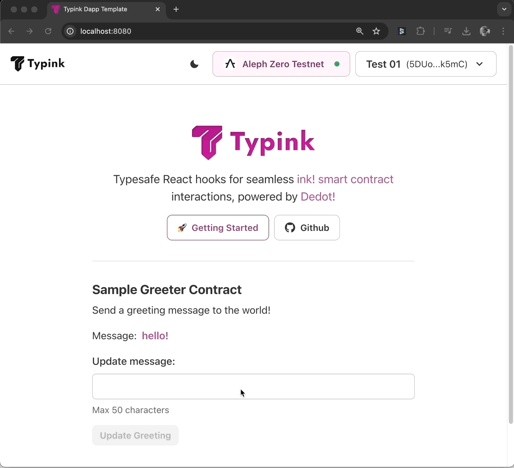

# txToaster

### Quick look

<figure><figcaption></figcaption></figure>

### Usage

<pre class="language-tsx"><code class="lang-tsx">// ...

import { useContract, useContractTx } from 'typink';
import { ContractId } from 'contracts/deployments.ts';
import { GreeterContractApi } from 'contracts/types/greeter';
<a data-footnote-ref href="#user-content-fn-1">import { txToaster } from '@/utils/txToaster.tsx';</a>

const [message, setMessage] = useState('');
const { contract } = useContract&#x3C;GreeterContractApi>(ContractId.GREETER);
const setMessageTx = useContractTx(contract, 'setMessage');

const doSetMessage = async () => {
  if (!contract || !message) return;

  <a data-footnote-ref href="#user-content-fn-2">const toaster = txToaster();</a>
  
  try {
    await setMessageTx.signAndSend({
      args: [message],
      callback: (progress) => {
        const { status } = progress;
        console.log(status);

        if (status.type === 'BestChainBlockIncluded') {
          setMessage(''); // Reset the message if the transaction is in block
        }

        // showing a toast notifying transaction status
        <a data-footnote-ref href="#user-content-fn-3">toaster.onTxProgress(progress);</a>
      },
    });
  } catch (e: any) {
    console.error('Fail to make transaction:', e);
    // showing a toast message
    <a data-footnote-ref href="#user-content-fn-4">toaster.onTxError(e);</a>
  }
}

// ...
</code></pre>

[^1]: Import `txToaster`

[^2]: Create a toaster instance

[^3]: Updates transaction progress

[^4]: Showing transaction errors
